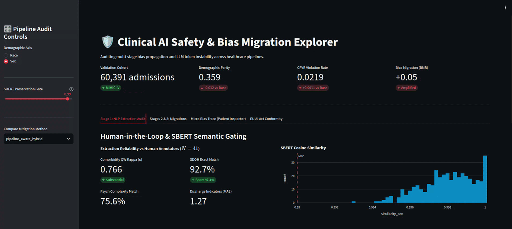

# From Stage to System: Bias Propagation in Clinical AI Pipelines 🛡️



This repository contains the code and methodology for evaluating how bias propagates through multi-stage clinical AI systems. We audit an end-to-end pipeline (LLM risk extraction, XGBoost readmission classifier, and care management thresholding) to test whether localized fairness interventions genuinely reduce downstream discrimination or merely force it to migrate.

## At a Glance
* ~400,000 MIMIC-IV admissions in the final cohort (279,569 train / 60,391 val / 59,409 test), 35 tabular features
* 8 methods benchmarked (baseline plus 7 mitigation/bias-migration methods: reweighting, equalized odds, adversarial debiasing, CDA, path-aware CDA, DoWhy SCM, pipeline-aware hybrid)
* 3 protected attribute axes (race, sex, insurance) plus 2 intersectional combinations (race×sex, race×insurance)
* 
## Pipeline Architecture
1. **Stage 1 (Clinical NLP Extraction):** Llama-3.1-8B-Instruct extracts comorbidity and social determinants from discharge notes.
2. **Stage 2 (Tabular Classifier):** An XGBoost model predicts 30-day hospital readmission using structured features and Stage 1 outputs.
3. **Stage 3 (Care Management):** A top 10% thresholding rule determines care enrollment.

## Data Access and Handling
This project utilizes the **MIMIC-IV** dataset. Due to the strict Data Use Agreement (DUA), we cannot distribute the raw clinical notes or patient tables. 
* To run this code, you must independently request access to MIMIC-IV via PhysioNet.
* Once approved, place the raw CSV files (e.g., `admissions.csv`, `patients.csv`, `discharge.csv`) into the `data/raw/` directory.

## Installation

Clone the repository and install the required dependencies:
```bash
git clone https://github.com/hilinafissha/clinical-ai-bias-pipeline
cd clinical-bias-migration
pip install -r requirements.txt

```

## Reproducing the Experiments

The pipeline is divided into modular Jupyter Notebooks. Execute them in the following sequence to reproduce the study:

1. `preprocessing.ipynb`: Cleans tabular features, maps ICD codes, and generates the patient-level train/val/test cohort splits.
2. `stage-1-risk-extraction.ipynb`: Runs local LLM inference to parse the clinical discharge summaries.
3. `counterfactual-generation-and-semantic-audit.ipynb`: Generates template-based demographic perturbations and validates semantic consistency via SBERT.
4. `readmission-risk-classifier.ipynb`: Trains and calibrates the Stage 2 XGBoost tabular model.
5. `scratch-training.ipynb`: Extends the Stage 1 sub-analysis by training XGBoost from scratch on the 3,986-patient cohort. 
   * Both models are trained on the same data and with the same algorithm; the only difference is that Model B includes the 9 discharge note features as additional inputs.
6. `fairness-baseline.ipynb`: Evaluates end-to-end pipeline bias and benchmarks the mitigation methods.


## Bias Trace Visualizer Dashboard
We provide an interactive Streamlit dashboard to audit cohort-level bias migration and trace individual patient decisions. This tool maps directly to the transparency and human oversight conformity assessments required by the EU AI Act for high-risk healthcare AI.

Ensure your generated .parquet output files are located in the output/ directory, then launch the application:

```bash
streamlit run app.py
```
### Dashboard Features

* **Macro Audit:** Evaluate semantic preservation KDE gates and overall risk divergence distributions.
* **Micro Trace:** Input a patient `hadm_id` to trace how a demographic token swap alters the LLM extraction, shifts the downstream XGBoost risk probability, and impacts the final care management decision.

---

**Authors:** Luwam Major Kefali & Hilina Fissha Woreta  
**Institution:** University of Bologna, Master of Science in Artificial Intelligence  
**Course:** Ethics in AI
